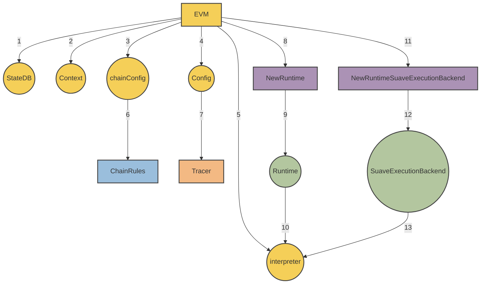

# SUAVE

[](https://goreportcard.com/report/github.com/flashbots/suave-geth)
[](https://github.com/flashbots/suave-geth/actions/workflows/checks.yml)

[SUAVE](https://writings.flashbots.net/mevm-suave-centauri-and-beyond) is designed to decentralize the MEV supply chain by enabling centralized infrastructure (builders, relays, centralized RFQ routing, etc.) to be programmed as smart contracts on a decentralized blockchain.

`suave-geth` is a work-in-progress Golang SUAVE client consisting of two separable components: chain nodes and execution nodes. SUAVE clients offer confidential execution for smart contracts, allowing off-chain processing with extended precompiles for enhanced MEV functionalities, including transaction simulation via geth RPC, block building, and relay boosting, all handled by dedicated execution nodes.

For a deeper dive, check out the [technical details section](#suave-geth-technical-details), [simple MEV-share walk through](suave/cmd/suavecli/README.md), and the [demo video from EthCC](https://drive.google.com/file/d/1IHuLtxwjRvRpYjMG3oRuAgS5MUZtmAXq/view?usp=sharing).

---

**Table of Contents**

1. [Getting Started](#getting-started)
    1. [How do I use the SUAVE?](#how-do-i-use-suave)
    1. [How do I execute a contract confidentially?](#how-do-i-execute-a-contract-confidentially)
    1. [How do I run a SUAVE chain node?](#how-do-i-run-a-suave-chain-node)
    1. [How do I run a SUAVE execution node?](#how-do-i-run-a-suave-execution-node)
1. [suave-geth technical details](#suave-geth-technical-details)
    1. [SUAVE Runtime (MEVM)](#suave-runtime-mevm)
    1. [Confidential execution of smart contracts](#confidential-execution-of-smart-contracts)
    1. [Confidential compute requests](#confidential-compute-requests)
    1. [SUAVE Bids](#suave-bids)
    1. [SUAVE library](#suave-library)
    1. [Offchain APIs](#offchain-apis)
    1. [Confidential Store](#confidential-store)
    1. [SUAVE Mempool](#suave-mempool)
    1. [Notable differences from standard issue go-ethereum](#notable-differences-from-standard-issue-go-ethereum)
    1. [Suave precompiles](#suave-precompiles)

---

## Getting Started

### How do I use SUAVE?

1. **Deploy confidential smart contracts.**
   Smart contracts on SUAVE follow the same rules as on Ethereum with the added advantage of being able to access additional precompiles during confidential execution. Precompiles are available through the [SUAVE library](#suave-library).

2. **NEW! Request confidential execution using the new confidential computation request.**
   Contracts called using confidential compute requests have access to off-chain data and APIs through SUAVE precompiles. Confidential computation is *not* reproducible on-chain, thus, users are required to whitelist a specific execution node trusted to provide the result. Eventually proofs and trusted enclaves will help to verify the results of execution.
      After the initial confidential computation, its result replaces the calldata for on-chain execution. This grants different behaviors to confidential, treated as off-chain, and regular on-chain transactions since off-chain APIs are inaccessible during regular chain state transition.


   See [confidential compute requests](#Confidential-compute-requests) for more details.

### How do I execute a contract confidentially?

Let’s take a look at how you can request confidential computation through an execution node. In the code sometimes we refer to confidential computation as "off-chain" (expect unification).

1. Pick your favorite execution node. You’ll need its URL and wallet address. Note that the execution node is fully trusted to provide the result of your off-chain computation.

2. Craft your confidential computation request. This is a regular Ethereum transaction, where you specify the desired contract address and it’s (public) calldata. I’m assuming you have found or deployed a smart contract which you intend to call. Don’t sign the transaction quite yet!

    ```go
    allowedPeekers := []common.Address{newBlockBidPeeker, newBundleBidPeeker, buildEthBlockPeeker} // express which contracts should have access to your data (by their addresses)
    offchainInnerTx := &types.LegacyTx{
        Nonce:    suaveAccNonce,
        To:       &newBundleBidAddress,
        Value:    nil,
        Gas:      1000000,
        GasPrice: 50,
        Data:     bundleBidAbi.Pack("newBid", targetBlock, allowedPeekers)
    }
    ```

3. Wrap your regular transaction into the new `OffchainTx` transaction type, and specify the execution node’s wallet address as the `ExecutionNode` field. Sign the transaction with your wallet.

    ```go
    offchainTx := types.SignTx(types.NewTx(&types.OffchainTx{
        ExecutionNode: "0x4E2B0c0e428AE1CDE26d5BcF17Ba83f447068E5B",
        Wrapped:       *types.NewTx(&offchainInnerTx),
    }), suaveSigner, privKey)
    ```

4. Request confidential computation by submitting your transaction along with your confidential data to the execution node you chose via `eth_sendRawTransaction`.

    ```go
    confidentialDataBytes := hexutil.Encode(ethBundle)
    suaveClient.Call("eth_sendRawTransaction", offchainTx, confidentialDataBytes)
    ```

5. All done! Once the execution node processes your computation request, the execution node will submit it as `OffchainExecutedTransaction` to the mempool.

For more on confidential compute requests see [confidential compute requests](#Confidential-compute-requests).

### How do I run a SUAVE chain node?

1. Build the client with `make geth`.
2. Run the node. Pass in `--dev` to enable local devnet. Example:

    ```go
    ./build/bin/geth --dev --dev.gaslimit 30000000 --datadir suave_dev --http --ws --allow-insecure-unlock --unlock "0xd52d1935D1239ADf94C59fA0F586fE00250694d5"
    ```

3. Do your thing!

### How do I run a SUAVE execution node?

Not all nodes serve confidential compute requests. You’ll need:
- A SUAVE node (see above).
- An account. If you are doing this for testing, simply run `geth --suave account new`. Take note of the address.
- Access to Ethereum’s RPC. When starting your node, pass in `--suave.eth.remote_endpoint` to point to your Ethereum RPC for off-chain execution.
    ```go
    ./build/bin/geth --dev --dev.gaslimit 30000000 --datadir suave_dev --http --allow-insecure-unlock --unlock "0x<YOUR_PUBKEY>" --ws --suave.eth.remote_endpoint "http://<EXECUTION_NODE_IP>"
    ```
Note that simply enabling http jsonrpc and allowing direct access might not be the wisest. Look into proxyd and other restricted access solutions.

## suave-geth technical details

### SUAVE Runtime (MEVM)

[`SuaveExecutionBackend`](#SuaveExecutionBackend) 🤝 EVM = MEVM

More specifically, `SuaveExecutionBackend` and `Runtime` add functionality to the stock EVM which allows it both confidential computation and interaction with off-chain APIs.



The capabilities enabled by this modified runtime are exposed via the APIs `ConfiendialStoreBackend` , `MempoolBackend`, `ConfiendialStoreBackend`, as well as access to `confidentialInputs` to confidential compute requests and `callerStack`.

```go
func NewRuntimeSuaveExecutionBackend(evm *EVM, caller common.Address) *SuaveExecutionBackend {
	if !evm.Config.IsOffchain {
		return nil
	}

	return &SuaveExecutionBackend{
		ConfiendialStoreBackend: evm.suaveExecutionBackend.ConfiendialStoreBackend,
		MempoolBackned:          evm.suaveExecutionBackend.MempoolBackned,
		OffchainEthBackend:      evm.suaveExecutionBackend.OffchainEthBackend,
		confidentialInputs:      evm.suaveExecutionBackend.confidentialInputs,
		callerStack:             append(evm.suaveExecutionBackend.callerStack, &caller),
	}
}
```

All of these newly offered APIs are available to your solidity smart contract through the use of precompiles! See below for how confidential computation and smart contracts interact.

### Confidential execution of smart contracts

The virtual machine (MEVM) inside SUAVE nodes have two modes of operation: regular and confidential (sometimes called off-chain). Regulal on-chain environment is your usual Ethereum virtual machine environment.

Confidential environment is available to users through a new type of ransaction - `OffchainTx` via the usual jsonrpc methods `eth_sendRawTransaction`, `eth_sendTransaction` and `eth_call`. Simulations (`eth_call`) requested with a new optional argument `IsOffchain are also executed in the confidential mode`. For more on confidential requests see [confidential compute requests](#Confidential-compute-requests).

The confidential execution environment provides additional precompiles, both directly and through a convenient [library](#SUAVE-library). Confidential execution is *not* verifiable during on-chain state transition, instead the result of the confidential execution is cached in the transaction (`OffchainExecutedTx`). Users requesting confidential compute requests specify which execution nodes they trust with execution, and the execution nodes' signature is used for verifying the transaction on-chain.

The cached result of confidential execution is used as calldata in the transaction that inevitably makes its way onto the SUAVE chain.

Other than ability to access new precompiles, the contracts aiming to be executed confidentially are written as usual in Solidity (or any other language) and compiled to EVM bytecode.

### Confidential compute requests

We introduce two new transaction types: `OffchainTx`, serving as a request of confidential computation, and `OffchainExecutedTx` which is the result of a confidential computation. The new confidential computation transactions track the usage of gas during confidential computation, and contain (or reference) the result of the computation in a chain-friendly manner.


confidential compute requests (`OffchainTx`) are only intermediary message between the user requesting confidential computation and the execution node, and are not currently propagated through the mempool or included in blocks. The results of those computations (`OffchainExecutedTx`) are treated as regular transactions.

```go
type OffchainTx struct {
    ExecutionNode common.Address
    Wrapped  Transaction
}
```

`OffchainExecutedTx` transactions are propagated through the mempool and inserted into blocks as expected, unifying confidential computation with regular on-chain execution.

```go
type OffchainExecutedTx struct {
    ExecutionNode  common.Address
    Wrapped        Transaction
    OffchainResult []byte
    /* Execution node's signature fields */
}
```

The confidential computation result is placed in the `OffchainResult` field, which is further used instead of the original transaction's calldata for on-chain execution.

The basic flow is as follows:

1. User crafts a usual legacy/dynamic transaction, which calls the contract of their liking
2. User crafts the confidential computation request (`OffchainTx`):
    1. User choses an execution node of their liking, that is an address whose signature over the confidential computation result will be trusted
    2. User embeds the transaction from (1.) into an `OffchainTx` together with the desired execution node's address
    3. User signs and sends the confidential computation request to an execution node via `eth_sendRawTransaction` (possibly passing in additional confidential data)
3. The execution node executes the transaction in the confidential mode, providing access to the usual off-chain APIs
4. Execution node creates an `OffchainExecutedTx` using the confidential computation request the result of its execution, signs and submits the transaction into the mempool
5. The transaction makes its way into a block, by executing the `OffchainResult` as calldata, as long as the execution node's signature matches the requested executor node in (2.1.)

The user passes in any confidential data through the new `confidential_data` parameter of the `eth_sendRawTransaction` RPC method. The initial confidential computation has access to both the public and confidential data, but only the public data becomes part of the transaction propagated through the mempool. Any confidential data passed in by the user is discarded after the execution.

Architecture reference


Mind, that the results are not reproducible as they are based on confidential data that is dropped after execution, and off-chain data that might change with time. On-chain state transition only depends on the result of the confidential computation, so it is fully reproducible.

### SUAVE Bids

On the SUAVE chain, bids serve as the primary transaction unit, and are used for interactions between smart contracts and the Confidential Store.

A `Bid` is a data structure encapsulating key information about a transaction on the SUAVE chain.

```go
type Bid struct {
	Id                  BidId            `json:"id"`
	DecryptionCondition uint64           `json:"decryptionCondition"`
	AllowedPeekers      []common.Address `json:"allowedPeekers"`
	Version             string           `json:"version"`
}
```

Each `Bid` has an `Id`, a `DecryptionCondition`, an array of `AllowedPeekers`, and a `Version`. The `DecryptionCondition` signifies the block number at which the bid can be decrypted and is typically derived from the source contract or may even be a contract itself. The `AllowedPeekers` are the addresses that are permitted to access the data associated with the bid, providing an added layer of access control. The `Version` indicates the version of the protocol used for the bid.

### SUAVE library

Along the SUAVE precompiles, we provide a convenient wrapper for calling them from Solidity. The [library](suave/sol/libraries/Suave.sol) makes the precompiles easier to call by providing the signatures, and the library functions themselves simply perform a `staticcall` of the requested precompile.

```solidity
library Suave {
    error PeekerReverted(address, bytes);

    type BidId is bytes16;

    struct Bid {
        BidId id;
        uint64 decryptionCondition;
        address[] allowedPeekers;
    }

    function isOffchain() internal view returns (bool b)
    function confidentialInputs() internal view returns (bytes memory)
    function newBid(uint64 decryptionCondition, address[] memory allowedPeekers, string memory BidType) internal view returns (Bid memory)
    function fetchBids(uint64 cond, string memory namespace) internal view returns (Bid[] memory)
    function confidentialStoreStore(BidId bidId, string memory key, bytes memory data) internal view
    function confidentialStoreRetrieve(BidId bidId, string memory key) internal view returns (bytes memory)
    function simulateBundle(bytes memory bundleData) internal view returns (bool, uint64)
    function extractHint(bytes memory bundleData) internal view returns (bytes memory)
    function buildEthBlock(BuildBlockArgs memory blockArgs, BidId bid, string memory namespace) internal view returns (bytes memory, bytes memory)
    function submitEthBlockBidToRelay(string memory relayUrl, bytes memory builderBid) internal view returns (bool, bytes memory)
}
```

### Offchain APIs

Off-chain precompiles have access to the following [off-chain APIs](suave/core/types.go) during execution.

```go
type ConfiendialStoreBackend interface {
    Initialize(bid Bid, key string, value []byte) (Bid, error)
    Store(bidId BidId, caller common.Address, key string, value []byte) (Bid, error)
    Retrieve(bid BidId, caller common.Address, key string) ([]byte, error)
}

type MempoolBackend interface {
    SubmitBid(Bid) error
    FetchBidById(BidId) (Bid, error)
    FetchBidsByProtocolAndBlock(blockNumber uint64, namespace string) []Bid
}

type OffchainEthBackend interface {
    BuildEthBlock(ctx context.Context, args *BuildBlockArgs, txs types.Transactions) (*engine.ExecutionPayloadEnvelope, error)
    BuildEthBlockFromBundles(ctx context.Context, args *BuildBlockArgs, bundles []types.SBundle) (*engine.ExecutionPayloadEnvelope, error)
}
```

### Confidential Store

The Confidential Store is an integral part of the SUAVE chain, designed to facilitate secure and privacy-preserving transactions and smart contract interactions. It functions as a key-value store where users can safely store and retrieve confidential data related to their bids. The Confidential Store restricts access (both reading and writing) only to the allowed peekers of each bid, allowing developers to define the entire data model of their application!

The current, and certainly not final, implementation of the Confidential Store is managed by the `LocalConfidentialStore` struct. It provides thread-safe access to the bids' confidential data. The `LocalConfidentialStore` struct is composed of a mutex lock and a map of bid data, `ACData`, indexed by a `BidId`.

```go
type LocalConfidentialStore struct {
	lock sync.Mutex
	bids map[suave.BidId]ACData
}
```
`ACData` is another struct that contains a `bid` and a `dataMap`. The `dataMap` is a key-value store that holds the actual confidential data of the bids.

```go
type ACData struct {
	bid     suave.Bid
	dataMap map[string][]byte
}
```

The `LocalConfidentialStore` provides the following key methods:

- **Initialize**: This method is used to initialize a bid with a given `bid.Id`. If no `bid.Id` is provided, a new one is created. The method is trusted, meaning it is not directly accessible through precompiles.
- **Store**: This method stores a given value under a specified key in a bid's `dataMap`. Access is restricted only to addresses listed in the bid's `AllowedPeekers`.
- **Retrieve**: This method retrieves data associated with a given key from a bid's `dataMap`. Similar to the `Store` method, access is restricted only to addresses listed in the bid's `AllowedPeekers`.

It is important to note that the actual implementation of the Confidential Store will vary depending on future requirements and the privacy mechanisms used.

### SUAVE Mempool

The SUAVE mempool is a temporary storage pool for transactions waiting to be added to the blockchain. This mempool, `MempoolOnConfidentialStore`, operates on the Confidential Store, hence facilitating the privacy-preserving handling of bid transactions. The `MempoolOnConfidentialStore` is designed to handle SUAVE bids, namely the submission, retrieval, and grouping of bids by decryption condition such as block number and protocol. It provides a secure and efficient mechanism for managing these transactions while preserving their confidentiality.

The `MempoolOnConfidentialStore` interacts directly with the `ConfiendialStoreBackend` interface.

```go
type MempoolOnConfidentialStore struct {
	cs suave.ConfiendialStoreBackend
}
```
It is initialized with a predefined `mempoolConfidentialStoreBid` that's only accessible by a particular address `mempoolConfStoreAddr`.

```go
mempoolConfidentialStoreBid = suave.Bid{Id: mempoolConfStoreId, AllowedPeekers: []common.Address{mempoolConfStoreAddr}}
```
The `MempoolOnConfidentialStore` includes three primary methods:

- **SubmitBid**: This method submits a bid to the mempool. The bid is stored in the Confidential Store with its ID as the key. Additionally, the bid is grouped by block number and protocol, which are also stored in the Confidential Store.

- **FetchBidById**: This method retrieves a bid from the mempool using its ID.

- **FetchBidsByProtocolAndBlock**: This method fetches all bids from a particular block and matching a specified protocol.

The mempool operates on the underlying Confidential Store, thereby maintaining the confidentiality of the bids throughout the transaction process. As such, all data access is subject to the Confidential Store's security controls, ensuring privacy and integrity. Please note that while this initial implementation provides an idea of the ideal functionality, the final version will most likely incorporate additional features or modifications.

## Notable differences from standard issue go-ethereum

### Changes to RPC methods

1. New `IsOffchain` and `ExecutionNode` fields are added to TransactionArgs, used in `eth_sendTransaction` and `eth_call` methods.
If `IsOffchain` is set to true, the call will be performed as an off-chain call, using the `ExecutionNode` passed in for constructing `OffchainTx`.
`OffchainExecutedTx` is the result of `eth_sendTransaction`!

2. New optional argument - `confidential_data` is added to `eth_sendRawTransaction`, `eth_sendTransaction` and `eth_call` methods.
The confidential data is made available to the EVM in the confidential mode via a precompile, but does not become a part of the transaction that makes it to chain. This allows performing computation based on confidential data (like simulating a bundle, putting the data into confidential store).


### SuavePrecompiledContract

We introduce a new interface [SuavePrecompiledContract](core/vm/contracts.go) for SUAVE precompiles.

```
type SuavePrecompiledContract interface {
	PrecompiledContract
	RunOffchain(backend *SuaveExecutionBackend, input []byte) ([]byte, error)
}
```

The method `RunOffchain` is invoked during confidential execution, and the suave execution backend which provides access to off-chain APIs is passed in as input.

### SUAVE precompile wrapper

We introduce [SuavePrecompiledContractWrapper](core/vm/suave.go) implementing the `PrecompiledContract` interface. The new structure captures the off-chain APIs in its constructor, and passes the off-chain APIs during the usual contract's `Run` method to a separate method - `RunOffchain`


### SuaveExecutionBackend

We introduce [SuaveExecutionBackend](core/vm/suave.go), which allows access to off-chain capabilities during confidential execution:
* Access to off-chain APIs
* Access to confidential input
* Caller stack tracing

The backend is only available to confidential execution!

### EVM Interpreter

The [EVM interpreter](core/vm/interpreter.go) is modified to allow for confidential computation's needs:
* We introduce `IsOffchain` to the interpreter's config
* We modify the `Run` function to accept off-chain APIs `func (in *EVMInterpreter) Run(*SuaveExecutionBackend, *Contract, []byte, bool) ([]byte, err)`
* We modify the `Run` function to trace the caller stack


Like `eth_sendTransaction`, this method accepts an additional, optional confidential inputs argument.


### Basic Eth block building RPC

We implement two rpc methods that allow building Ethereum blocks from a list of either transactions or bundles: `BuildEth2Block` and `BuildEth2BlockFromBundles`.

This methods are defined in [BlockChainAPI](internal/ethapi/api.go)

```go
func (s *BlockChainAPI) BuildEth2Block(ctx context.Context, buildArgs *types.BuildBlockArgs, txs types.Transactions) (*engine.ExecutionPayloadEnvelope, error)
func (s *BlockChainAPI) BuildEth2BlockFromBundles(ctx context.Context, buildArgs *types.BuildBlockArgs, bundles []types.SBundle) (*engine.ExecutionPayloadEnvelope, error)

```

The methods are implemented in [worker](miner/worker.go), by `buildBlockFromTxs` and `buildBlockFromBundles` respectively.

`buildBlockFromTxs` will simply build a block out of the transactions provided, while `buildBlockFromBundles` will in addition forward the block profit to the requested fee recipient, as needed for boost relay payments.


## SUAVE precompiles

Additional precompiles available via the EVM.
Only `IsOffchain` is available during on-chain execution, and simply returns false.

For details and implementation see [contracts_suave.go](core/vm/contracts_suave.go)

### IsOffchain

|   |   |
|---|---|
| Address | `0x42010000` |
| Inputs | None |
| Outputs | boolean |

Outputs whether execution mode is regular (on-chain) or confidential.


### ConfidentialInputs

|   |   |
|---|---|
| Address | `0x42010001` |
| Inputs | None |
| Outputs | bytes |

Outputs the confidential inputs passed in with the confidential computation request.


NOTE: currently all precompiles have access to the data passed in. This might change in the future.

### ConfidentialStore

|   |   |
|---|---|
| Address | `0x42020000` |
| Inputs | (Suave.BidId bidId, string key, bytes data) |
| Outputs | None |


Stores the value in underlying confidential store.
Requires that the caller is present in the `AllowedPeekers` of the bid passed in!

### ConfidentialRetrieve

|   |   |
|---|---|
| Address | `0x42020001` |
| Inputs | (Suave.BidId bidId, string key) |
| Outputs | bytes |


Retrieves the value from underlying confidential store.
Requires that the caller is present in the `AllowedPeekers` of the bid passed in!


### NewBid


|   |   |
|---|---|
| Address | `0x42030000` |
| Inputs | (uint64 decryptionCondition, string[] allowedPeekers) |
| Outputs | Suave.Bid |

Initializes the bid in ConfidentialStore. All bids must be initialized before attempting to store data on them.
Initialization of bids can *only* be done through this precompile!

### FetchBids

|   |   |
|---|---|
| Address | `0x42030001` |
| Inputs | uint64 DecryptionCondition |
| Outputs | Suave.Bid[] |

Returns all bids matching the decryption condition.
This method is subject to change! In the near future bids will be stored in a different way, possibly changing how they are accessed.

### SimulateBundle

|   |   |
|---|---|
| Address | `0x42100000` |
| Inputs | bytes bundleArgs (json) |
| Outputs | (bool success, uint64 egp) |

Simulates the bundle by building a block containing it, returns whether the apply was successful and the EGP of the resulting block.

### ExtractHint

|   |   |
|---|---|
| Address | `0x42100037` |
| Inputs | bytes bundleData (json) |
| Outputs | bytes hintData (json) |

Parses the bundle data and extracts the hint - "To" address and the calldata.

The return structure is encoded as follows:
```
struct {
    To   common.Address
    Data []byte
}
```


### BuildEthBlock

|   |   |
|---|---|
| Address | `0x42100001` |
| Inputs | (Suave.BuildBlockArgs blockArgs, Suave.BidId bidId) |
| Outputs | (bytes builderBid, bytes blockPayload) |


Builds an Ethereum block based on the bid passed in.
The bid can either hold `ethBundle` in its confidential store, or be a "merged bid", ie contain a list of bids in `mergedBids` in its confidential store. The merged bids should themselves hold `ethBundle`.
The block is built *in order*, without any attepmts at re-ordering. The block will contain the transactions unless they failed to apply. The caller should check whether the bids applied successfully, ie whether they revert only if are allowed to.

### SubmitEthBlockBidToRelay

|   |   |
|---|---|
| Address | `0x42100002` |
| Inputs | (string relayUrl, bytes builderBid (json) |
| Outputs | (bytes error) |

Submits provided builderBid to a boost relay. If the submission is successful, returns nothing, otherwise returns an error string.

---

Made with ☀️ by the ⚡🤖 collective.
